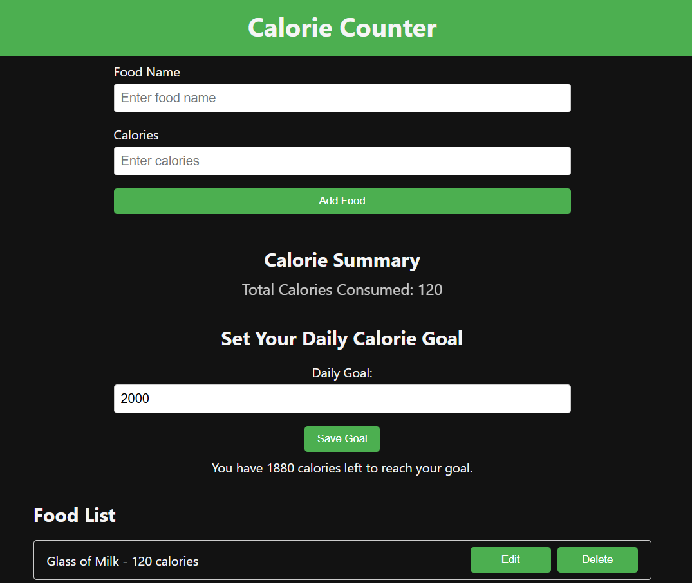

# Calorie Counter App

A simple and intuitive calorie tracking application built with React. Users can log their daily food intake, track their calorie consumption, and set daily calorie goals.



## Features

- Add and delete food entries.
- Set and track daily calorie goals.
- View a summary of daily calorie intake.
- Simple and user-friendly interface.

## Technologies

- Built with React.
- Uses local storage to save data.
- Responsive design for mobile and desktop.

## Installation

1. Clone the repository:
  ```bash
  git clone https://github.com/Espadv69/Calorie-Counter.git
  ```

2. Navigate to the project directory:
  ```bash
  cd Calorie-Counter
  ```

3. Install the dependencies:
  ```bash
  npm install
  ```

4. Start the development server:
  ```bash
  npm run dev
  ```
